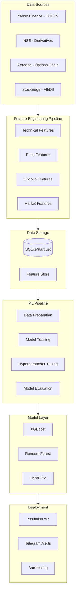
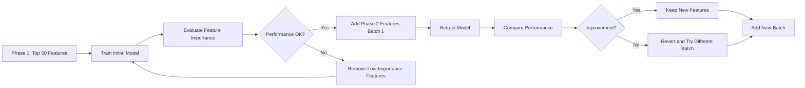
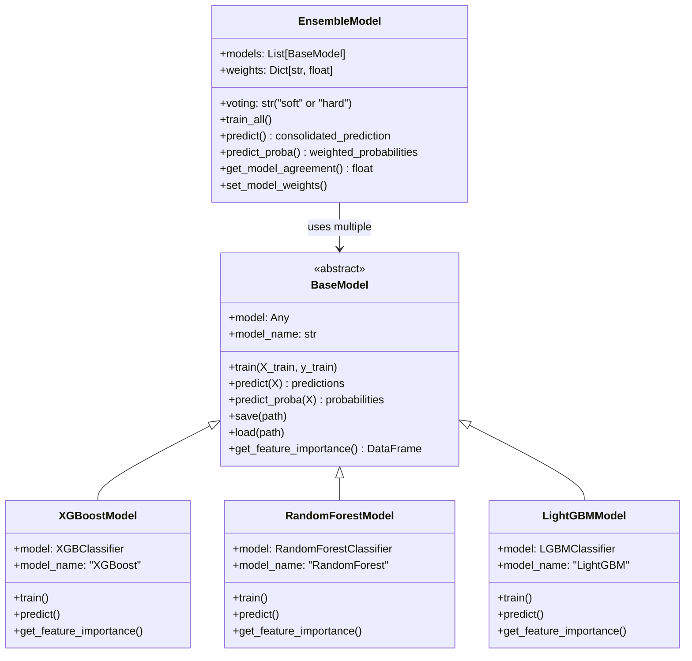
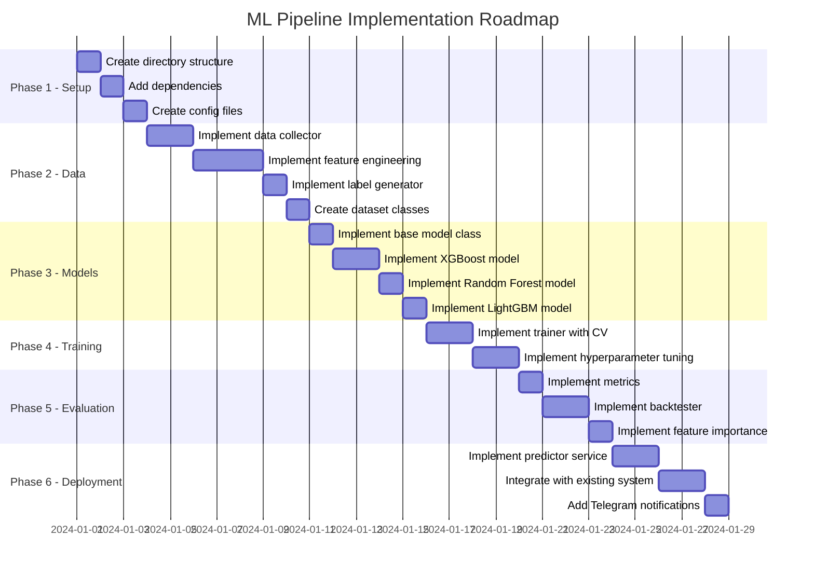

# AI-Based Stock Movement Prediction System - Implementation Plan

## Project Overview

**Goal**: Build an AI model to predict the direction of stock movement for positional trading.

**Specifications**:
- **Prediction Horizon**: Next trading day (1-day forward)
- **Target Definition**: 
  - **UP**: Next day return > +1%
  - **DOWN**: Next day return < -1%
  - **FLAT**: Between -1% and +1%
- **Stock Universe**: All F&O stocks (~180 stocks)
- **Model Approach**: Start with Traditional ML (XGBoost, Random Forest, LightGBM), expand to Deep Learning later

---

## Architecture Overview



---

## Phase 1: Project Setup and Data Infrastructure

### 1.1 Directory Structure

```
StockAnalysis/
├── ml_pipeline/                    # New ML module
│   ├── __init__.py
│   ├── config.py                   # Configuration and hyperparameters
│   ├── data/
│   │   ├── __init__.py
│   │   ├── data_collector.py       # Historical data collection
│   │   ├── feature_engineer.py     # Feature engineering
│   │   ├── label_generator.py      # Target label creation
│   │   └── dataset.py              # PyTorch/sklearn dataset classes
│   ├── features/
│   │   ├── __init__.py
│   │   ├── technical_features.py   # Technical indicators
│   │   ├── price_features.py       # Price-based features
│   │   ├── options_features.py     # Options data features
│   │   └── market_features.py      # Market-wide features
│   ├── models/
│   │   ├── __init__.py
│   │   ├── base_model.py           # Base model interface
│   │   ├── xgboost_model.py        # XGBoost classifier
│   │   ├── random_forest_model.py  # Random Forest classifier
│   │   ├── lightgbm_model.py       # LightGBM classifier
│   │   └── ensemble_model.py       # Ensemble model (combines all three)
│   ├── training/
│   │   ├── __init__.py
│   │   ├── trainer.py              # Training loop
│   │   ├── hyperparameter_tuning.py # Optuna integration
│   │   └── cross_validation.py     # Time-series CV
│   ├── evaluation/
│   │   ├── __init__.py
│   │   ├── metrics.py              # Evaluation metrics
│   │   ├── backtest.py             # Backtesting framework
│   │   └── feature_importance.py   # Feature analysis
│   ├── deployment/
│   │   ├── __init__.py
│   │   ├── predictor.py            # Real-time prediction
│   │   └── model_manager.py        # Model versioning
│   └── notebooks/
│       ├── 01_data_exploration.ipynb
│       ├── 02_feature_engineering.ipynb
│       ├── 03_model_training.ipynb
│       └── 04_evaluation.ipynb
├── data/
│   ├── raw/                        # Raw downloaded data
│   ├── processed/                  # Processed features
│   └── models/                     # Saved model artifacts
└── configs/
    └── ml_config.yaml              # ML-specific configuration
```

### 1.2 Dependencies to Add

Add to `requirements.txt`:
```
# Machine Learning
scikit-learn==1.5.0
xgboost==2.0.3
lightgbm==4.3.0
optuna==3.6.0
joblib==1.4.0

# Data Processing
pyarrow==15.0.0           # For Parquet files

# Optional for later phases
# torch==2.2.0           # For LSTM/Transformer
# tensorflow==2.15.0     # Alternative DL framework
```

---

## Phase 2: Feature Engineering Pipeline

### 2.1 Feature Categories

This section organizes features into **Phase 1 (Top 50)** and **Phase 2 (Additional)**. Features are prioritized based on their predictive power for stock direction, as supported by financial ML literature and practical trading experience.

---

## Phase 1: Top 50 Core Features (Initial Implementation)

These 50 features have the highest predictive value and should be implemented first.

### A. Technical Indicators - Top 20 Features

| Priority | Feature | Description | Period | Rationale |
|----------|---------|-------------|--------|-----------|
| 1 | RSI_14 | Relative Strength Index | 14 | Primary momentum indicator |
| 2 | RSI_5 | Short-term RSI | 5 | Captures quick momentum shifts |
| 3 | MACD | MACD Line | 12,26,9 | Trend-following momentum |
| 4 | MACD_Signal | Signal Line | 9 | Crossover signals |
| 5 | MACD_Histogram | MACD - Signal | - | Momentum acceleration |
| 6 | EMA_9 | Short EMA | 9 | Short-term trend |
| 7 | EMA_21 | Medium EMA | 21 | Medium-term trend |
| 8 | EMA_50 | Long EMA | 50 | Long-term trend |
| 9 | Bollinger_Upper | Upper Band | 20,2 | Overbought level |
| 10 | Bollinger_Lower | Lower Band | 20,2 | Oversold level |
| 11 | Bollinger_Percent | Position in bands | - | Normalized price position |
| 12 | ATR_14 | Average True Range | 14 | Volatility measure |
| 13 | ATR_Percent | ATR as % of price | 14 | Relative volatility |
| 14 | Stochastic_K | Stochastic K | 5,5 | Momentum oscillator |
| 15 | Stochastic_D | Stochastic D | 5,5 | Smoothed momentum |
| 16 | ADX | Average Directional Index | 14 | Trend strength |
| 17 | ADX_Positive | +DI | 14 | Bullish pressure |
| 18 | ADX_Negative | -DI | 14 | Bearish pressure |
| 19 | Supertrend | Supertrend indicator | 14,2.5 | Trend direction |
| 20 | Williams_R | Williams %R | 14 | Overbought/oversold |

### B. Price Features - Top 15 Features

| Priority | Feature | Description | Rationale |
|----------|---------|-------------|-----------|
| 21 | Returns_1d | 1-day return | Most recent momentum |
| 22 | Returns_5d | 5-day return | Short-term trend |
| 23 | Returns_10d | 10-day return | Medium-term trend |
| 24 | Volatility_10d | 10-day volatility | Recent volatility regime |
| 25 | High_Low_Pct | (High-Low)/Close | Intraday range |
| 26 | Close_Open_Pct | (Close-Open)/Open | Intraday momentum |
| 27 | Gap_Size | Opening gap % | Gap significance |
| 28 | Price_vs_EMA21 | Distance from EMA21 | Trend deviation |
| 29 | Price_vs_EMA50 | Distance from EMA50 | Major trend deviation |
| 30 | Distance_From_High_20 | % from 20d high | Breakout potential |
| 31 | Distance_From_Low_20 | % from 20d low | Breakdown potential |
| 32 | Price_Position_20d | Position in 20d range | Range position (0-100) |
| 33 | Momentum_5 | 5-day momentum | Price momentum |
| 34 | EMA_Cross_9_21 | EMA crossover signal | Trend change signal |
| 35 | Consecutive_Days | Consecutive up/down days | Exhaustion indicator |

### C. Volume Features - Top 10 Features

| Priority | Feature | Description | Rationale |
|----------|---------|-------------|-----------|
| 36 | Volume_Ratio_10d | Volume / 10d avg | Unusual volume detection |
| 37 | Volume_Ratio_20d | Volume / 20d avg | Volume trend |
| 38 | OBV | On-Balance Volume | Volume flow |
| 39 | OBV_EMA_5 | OBV 5-day EMA | Volume trend direction |
| 40 | Accumulation_Distribution | A/D Line | Money flow |
| 41 | Chaikin_Money_Flow | CMF indicator | Buying/selling pressure |
| 42 | Volume_Spike | Volume > 2x avg | Volume breakout |
| 43 | Volume_Dry_Up | Volume < 0.5x avg | Low interest |
| 44 | Intraday_Volume_Intensity | Volume / Range | Volume efficiency |
| 45 | Volume_Trend | Volume trend direction | Trend confirmation |

### D. Market Features - Top 5 Features

| Priority | Feature | Description | Rationale |
|----------|---------|-------------|-----------|
| 46 | Nifty_Returns_1d | Nifty daily return | Market direction |
| 47 | Beta_20d | 20-day beta vs Nifty | Market sensitivity |
| 48 | Sector_Relative_Strength | Stock vs Nifty performance | Relative performance |
| 49 | Correlation_Nifty_20d | Correlation with Nifty | Market coupling |
| 50 | Nifty_Volatility_5d | Nifty 5d volatility | Market volatility regime |

---

## Phase 2: Additional Features (Incremental Addition)

These features can be added incrementally after Phase 1 is validated.

### E. Extended Technical Indicators

| Feature | Description | Period | When to Add |
|---------|-------------|--------|-------------|
| RSI_10 | Medium-term RSI | 10 | After Phase 1 validation |
| EMA_200 | Very long EMA | 200 | For long-term trend context |
| SMA_20, SMA_50 | Simple Moving Averages | 20, 50 | Alternative to EMA |
| Bollinger_Width | Band width | - | Volatility squeeze detection |
| CCI | Commodity Channel Index | 20 | Cyclical patterns |
| MFI | Money Flow Index | 14 | Volume-weighted RSI |

### F. Advanced Price Features

| Feature | Description | When to Add |
|---------|-------------|-------------|
| Returns_20d | 20-day return | After Phase 1 |
| Log_Returns_1d, Log_Returns_5d | Log returns | For statistical analysis |
| Volatility_5d, Volatility_20d | Multiple volatility periods | Volatility regime detection |
| Parkinson_Volatility | High-Low volatility | More accurate volatility |
| Garman_Klass_Volatility | OHLC volatility | Advanced volatility estimator |
| Higher_High, Lower_Low | Swing points | Pattern recognition |
| Typical_Price | (H+L+C)/3 | Alternative price measure |
| Weighted_Close | (H+L+2C)/4 | Weighted price |

### G. Extended Volume Features

| Feature | Description | When to Add |
|---------|-------------|-------------|
| Volume_Ratio_5d | Short-term volume ratio | Quick volume changes |
| Volume_Z_Score | Standardized volume | Statistical volume analysis |
| OBV_EMA_20 | OBV 20-day EMA | Longer volume trend |
| Volume_Price_Trend | VPT indicator | Price-volume relationship |
| Money_Flow_Volume | MFV indicator | Money flow |
| Relative_Volume | Volume vs pattern | Time-based volume analysis |

### H. Candlestick Pattern Features

| Feature | Description | When to Add |
|---------|-------------|-------------|
| Single_Candle_Pattern | Doji, Hammer, etc. | Pattern recognition |
| Double_Candle_Pattern | Engulfing, Harami, etc. | Reversal signals |
| Triple_Candle_Pattern | Morning/Evening Star | Complex patterns |
| Pattern_Strength | Pattern reliability | Pattern confidence |
| Candle_Body_Size | Body % of range | Candle analysis |
| Upper_Shadow, Lower_Shadow | Shadow sizes | Rejection levels |
| Candle_Color | Bullish/Bearish | Direction indicator |

### I. Lagged Features (Temporal Patterns)

| Feature | Description | When to Add |
|---------|-------------|-------------|
| Return_Lag_1 to Lag_5 | Previous 5 days returns | Autoregressive patterns |
| RSI_Lag_1, RSI_Lag_2 | Previous RSI values | RSI momentum |
| Volume_Ratio_Lag_1 to Lag_3 | Previous volume ratios | Volume persistence |
| Trend_Direction_Lag_1 to Lag_5 | Previous trends | Trend persistence |

### J. Statistical Features

| Feature | Description | When to Add |
|---------|-------------|-------------|
| Skewness_20d | Return skewness | Distribution shape |
| Kurtosis_20d | Return kurtosis | Tail risk |
| Z_Score_Close | Standardized price | Statistical position |
| Percentile_Rank_20d | Price percentile | Relative position |
| Hurst_Exponent | Trend persistence | Mean reversion detection |
| Autocorrelation_5d | Return autocorrelation | Predictability measure |

---

## Feature Selection Strategy

### Incremental Addition Process



### Feature Importance Evaluation

1. **Tree-based Importance**: Use XGBoost/Random Forest feature importance scores
2. **Permutation Importance**: Shuffle features and measure performance drop
3. **SHAP Values**: Explain individual predictions and aggregate importance
4. **Correlation Analysis**: Remove highly correlated features (correlation > 0.95)
5. **Recursive Feature Elimination**: Iteratively remove least important features

### Feature Removal Criteria

Remove features that:
- Have near-zero importance across multiple training runs
- Are highly correlated with other features (keep one)
- Do not improve model performance when added
- Cause overfitting (high training accuracy, low validation accuracy)

### 2.2 Feature Engineering Implementation

```python
# ml_pipeline/features/technical_features.py

class TechnicalFeatureEngineer:
    """Generate technical indicator features from OHLCV data."""
    
    def __init__(self, config: dict):
        self.rsi_periods = config.get('rsi_periods', [5, 10, 14])
        self.ema_periods = config.get('ema_periods', [9, 21, 50, 200])
        # ... other config
    
    def generate_features(self, df: pd.DataFrame) -> pd.DataFrame:
        """
        Generate all technical features.
        
        Args:
            df: DataFrame with OHLCV columns
            
        Returns:
            DataFrame with technical features
        """
        features = pd.DataFrame(index=df.index)
        
        # RSI features
        for period in self.rsi_periods:
            features[f'RSI_{period}'] = self._compute_rsi(df['Close'], period)
        
        # MACD features
        macd, signal, hist = self._compute_macd(df['Close'])
        features['MACD'] = macd
        features['MACD_Signal'] = signal
        features['MACD_Histogram'] = hist
        
        # ... more features
        
        return features
```

### 2.3 Label Generation

```python
# ml_pipeline/data/label_generator.py

class LabelGenerator:
    """Generate target labels for prediction."""
    
    def __init__(self, up_threshold: float = 1.0, down_threshold: float = -1.0):
        self.up_threshold = up_threshold
        self.down_threshold = down_threshold
    
    def generate_labels(self, df: pd.DataFrame) -> pd.Series:
        """
        Generate direction labels based on next-day returns.
        
        Labels:
            1 = UP (return > +1%)
            0 = FLAT (-1% <= return <= +1%)
            -1 = DOWN (return < -1%)
        """
        # Calculate next-day returns
        next_day_returns = df['Close'].pct_change().shift(-1) * 100
        
        # Generate labels
        labels = pd.Series(0, index=df.index)  # Default FLAT
        labels[next_day_returns > self.up_threshold] = 1   # UP
        labels[next_day_returns < self.down_threshold] = -1  # DOWN
        
        return labels
```

---

## Phase 3: Model Development

### 3.1 Model Architecture



### 3.1.1 Ensemble Model Strategy

The ensemble combines predictions from XGBoost, Random Forest, and LightGBM using **soft voting** (weighted probability averaging).

**Ensemble Prediction Formula:**
```
P_ensemble(class) = w1 * P_xgb(class) + w2 * P_rf(class) + w3 * P_lgbm(class)
final_prediction = argmax(P_ensemble)
```

**Weight Assignment Methods:**
1. **Equal Weights**: w1 = w2 = w3 = 1/3 (baseline)
2. **Performance-Based**: Weights proportional to validation accuracy
3. **Optimized**: Weights optimized via grid search on validation set

**Model Agreement Score:**
- Measures how many models agree on the prediction
- High agreement = higher confidence
- Low agreement = uncertain prediction (can filter out)

### 3.2 Base Model Interface

```python
# ml_pipeline/models/base_model.py

from abc import ABC, abstractmethod
from typing import Any, Dict, Optional
import pandas as pd
import numpy as np

class BaseModel(ABC):
    """Abstract base class for all ML models."""
    
    def __init__(self, model_params: Optional[Dict] = None):
        self.model = None
        self.model_params = model_params or {}
        self.is_trained = False
    
    @abstractmethod
    def train(self, X_train: pd.DataFrame, y_train: pd.Series, 
              X_val: Optional[pd.DataFrame] = None, 
              y_val: Optional[pd.Series] = None) -> None:
        """Train the model."""
        pass
    
    @abstractmethod
    def predict(self, X: pd.DataFrame) -> np.ndarray:
        """Make predictions."""
        pass
    
    @abstractmethod
    def predict_proba(self, X: pd.DataFrame) -> np.ndarray:
        """Get prediction probabilities."""
        pass
    
    @abstractmethod
    def save(self, path: str) -> None:
        """Save model to disk."""
        pass
    
    @abstractmethod
    def load(self, path: str) -> None:
        """Load model from disk."""
        pass
    
    @abstractmethod
    def get_feature_importance(self) -> pd.DataFrame:
        """Get feature importance scores."""
        pass
```

### 3.3 Training Pipeline

```python
# ml_pipeline/training/trainer.py

class ModelTrainer:
    """Handles model training with time-series cross-validation."""
    
    def __init__(self, model: BaseModel, config: TrainingConfig):
        self.model = model
        self.config = config
    
    def train_with_cv(self, X: pd.DataFrame, y: pd.Series) -> Dict:
        """
        Train model with time-series cross-validation.
        
        Uses Purged K-Fold CV to prevent data leakage.
        """
        from sklearn.model_selection import TimeSeriesSplit
        
        tscv = TimeSeriesSplit(n_splits=self.config.n_splits)
        results = []
        
        for fold, (train_idx, val_idx) in enumerate(tscv.split(X)):
            X_train, X_val = X.iloc[train_idx], X.iloc[val_idx]
            y_train, y_val = y.iloc[train_idx], y.iloc[val_idx]
            
            # Train model
            self.model.train(X_train, y_train, X_val, y_val)
            
            # Evaluate
            metrics = self._evaluate(X_val, y_val)
            metrics['fold'] = fold
            results.append(metrics)
        
        return pd.DataFrame(results)
```

### 3.4 Hyperparameter Tuning with Optuna

```python
# ml_pipeline/training/hyperparameter_tuning.py

import optuna

class HyperparameterTuner:
    """Optuna-based hyperparameter optimization."""
    
    def __init__(self, model_class, X, y, n_trials=100):
        self.model_class = model_class
        self.X = X
        self.y = y
        self.n_trials = n_trials
    
    def optimize(self) -> Dict:
        """Find optimal hyperparameters."""
        
        def objective(trial):
            params = self._get_param_space(trial)
            model = self.model_class(params)
            
            # Time-series CV
            cv_scores = self._cross_validate(model)
            return cv_scores.mean()
        
        study = optuna.create_study(direction='maximize')
        study.optimize(objective, n_trials=self.n_trials)
        
        return study.best_params
```

---

## Phase 4: Evaluation Framework

### 4.1 Evaluation Metrics

```python
# ml_pipeline/evaluation/metrics.py

class ModelEvaluator:
    """Comprehensive model evaluation."""
    
    @staticmethod
    def calculate_metrics(y_true, y_pred, y_proba=None) -> Dict:
        """
        Calculate classification metrics.
        
        Metrics:
        - Accuracy
        - Precision, Recall, F1 (per class)
        - Confusion Matrix
        - Log Loss
        - ROC-AUC (One-vs-Rest)
        """
        from sklearn.metrics import (
            accuracy_score, precision_recall_fscore_support,
            confusion_matrix, log_loss, roc_auc_score
        )
        
        metrics = {
            'accuracy': accuracy_score(y_true, y_pred),
            'precision_recall_f1': precision_recall_fscore_support(
                y_true, y_pred, average=None
            ),
            'confusion_matrix': confusion_matrix(y_true, y_pred),
        }
        
        if y_proba is not None:
            metrics['log_loss'] = log_loss(y_true, y_proba)
            metrics['roc_auc'] = roc_auc_score(
                y_true, y_proba, multi_class='ovr'
            )
        
        return metrics
```

### 4.2 Backtesting Integration

```python
# ml_pipeline/evaluation/backtest.py

class MLBacktester:
    """Backtest ML predictions with trading simulation."""
    
    def __init__(self, initial_capital: float = 100000):
        self.initial_capital = initial_capital
    
    def backtest_predictions(
        self, 
        predictions: pd.DataFrame,
        price_data: pd.DataFrame,
        confidence_threshold: float = 0.6
    ) -> Dict:
        """
        Backtest model predictions.
        
        Args:
            predictions: DataFrame with columns [date, stock, pred, proba]
            price_data: OHLCV price data
            confidence_threshold: Minimum probability to trade
            
        Returns:
            Performance metrics and trade history
        """
        trades = []
        
        for _, row in predictions.iterrows():
            if row['max_proba'] < confidence_threshold:
                continue
                
            # Simulate trade
            trade = self._execute_trade(row, price_data)
            trades.append(trade)
        
        return self._calculate_performance(trades)
```

---

## Phase 5: Deployment and Integration

### 5.1 Prediction Service

```python
# ml_pipeline/deployment/predictor.py

class StockPredictor:
    """Real-time stock movement prediction."""
    
    def __init__(self, model_path: str, feature_engineer):
        self.model = self._load_model(model_path)
        self.feature_engineer = feature_engineer
    
    def predict(self, stock_symbol: str, date: datetime) -> PredictionResult:
        """
        Generate prediction for a stock.
        
        Returns:
            PredictionResult with direction, probability, and confidence
        """
        # Get latest data
        stock_data = self._get_stock_data(stock_symbol, date)
        
        # Generate features
        features = self.feature_engineer.generate_features(stock_data)
        
        # Make prediction
        pred = self.model.predict(features)
        proba = self.model.predict_proba(features)
        
        return PredictionResult(
            stock_symbol=stock_symbol,
            prediction_date=date,
            direction=['DOWN', 'FLAT', 'UP'][pred[0]],
            probability=proba[0],
            confidence=max(proba[0])
        )
```

### 5.2 Integration with Existing System

```python
# Integration with intraday_monitor.py

def run_ml_predictions(stocks: List[Stock], predictor: StockPredictor):
    """Run ML predictions for all stocks after market close."""
    predictions = []
    
    for stock in stocks:
        try:
            result = predictor.predict(stock.stock_symbol, datetime.now())
            predictions.append(result)
            
            # Store in stock analysis
            stock.analysis['ML_PREDICTION'] = {
                'direction': result.direction,
                'probability': result.probability,
                'confidence': result.confidence
            }
        except Exception as e:
            logger.error(f"ML prediction failed for {stock.stock_symbol}: {e}")
    
    return predictions
```

---

## Phase 6: Implementation Roadmap

### Step-by-Step Implementation Order



---

## Key Considerations

### 1. Data Leakage Prevention

- **Purged Cross-Validation**: Ensure no overlap between train and validation sets
- **Feature Computation**: All features must be computed using only past data
- **Label Generation**: Labels are based on future returns, must be excluded from features

### 2. Class Imbalance

The target distribution is likely imbalanced:
- FLAT days: ~60-70%
- UP days: ~15-20%
- DOWN days: ~15-20%

Solutions:
- Use `class_weight='balanced'` in models
- Apply SMOTE or other oversampling techniques
- Use stratified sampling in cross-validation

### 3. Feature Selection

- Start with all features (~100+)
- Use feature importance from tree-based models
- Apply recursive feature elimination (RFE)
- Monitor for overfitting with too many features

### 4. Model Selection Criteria

| Model | Pros | Cons |
|-------|------|------|
| XGBoost | High accuracy, handles missing data, feature importance | Can overfit, many hyperparameters |
| Random Forest | Robust, less prone to overfitting, interpretable | Slower training, larger model size |
| LightGBM | Fast training, handles large datasets, memory efficient | Can overfit on small data |

### 5. Walk-Forward Validation

For time-series data, use walk-forward validation:
1. Train on Year 1-2, Test on Year 3
2. Train on Year 1-3, Test on Year 4
3. Train on Year 1-4, Test on Year 5
4. Average results across all test periods

---

## Success Metrics

### Model Performance Targets

| Metric | Target | Stretch Goal |
|--------|--------|--------------|
| Overall Accuracy | > 50% | > 55% |
| UP Precision | > 55% | > 60% |
| DOWN Precision | > 55% | > 60% |
| Sharpe Ratio (Backtest) | > 1.0 | > 1.5 |
| Max Drawdown | < 20% | < 15% |

### Business Metrics

- Reduce false positives (avoid losses from wrong predictions)
- High confidence predictions should have > 60% accuracy
- Model should work across different market conditions (bull/bear/sideways)

---

## Next Steps

1. **Review this plan** and provide feedback
2. **Prioritize phases** based on your immediate needs
3. **Start implementation** with Phase 1 (Project Setup)
4. **Iterate** based on initial results

---

## Appendix: Configuration Template

```yaml
# configs/ml_config.yaml

data:
  start_date: '2020-01-01'
  end_date: '2024-12-31'
  train_test_split: 0.8
  stocks_universe: 'fno'  # or 'nifty50', 'custom'
  data_source: 'yfinance'  # Primary data source

features:
  technical:
    enabled: true
    rsi_periods: [5, 10, 14]
    ema_periods: [9, 21, 50, 200]
    sma_periods: [20, 50]
    macd: [12, 26, 9]
    bollinger: [20, 2]
    atr_period: 14
    stochastic: [5, 5]
    adx_period: 14
    cci_period: 20
    williams_r_period: 14
    mfi_period: 14
  
  price:
    enabled: true
    return_periods: [1, 5, 10, 20]
    volatility_periods: [5, 10, 20]
    include_parkinson_volatility: true
    include_garman_klass: true
    include_gap_features: true
    include_swing_detection: true
  
  volume:
    enabled: true
    volume_ratio_periods: [5, 10, 20]
    include_obv: true
    include_accumulation_distribution: true
    include_chaikin_money_flow: true
    include_volume_spikes: true
  
  candlestick:
    enabled: true
    include_single_candle: true
    include_double_candle: true
    include_triple_candle: true
    include_candle_metrics: true  # body size, shadows, etc.
  
  market:
    enabled: true
    index_symbols: ['^NSEI', '^NSEBANK']  # Nifty 50, Bank Nifty
    include_beta: true
    include_correlation: true
    include_relative_strength: true
  
  lagged:
    enabled: true
    return_lags: [1, 2, 3, 4, 5]
    rsi_lags: [1, 2]
    volume_ratio_lags: [1, 2, 3]
  
  statistical:
    enabled: true
    distribution_window: 20
    include_skewness: true
    include_kurtosis: true
    include_hurst: true
    include_autocorrelation: true

labels:
  up_threshold: 1.0    # > 1% = UP
  down_threshold: -1.0  # < -1% = DOWN
  # Between -1% and +1% = FLAT

model:
  type: 'xgboost'
  params:
    n_estimators: 500
    max_depth: 6
    learning_rate: 0.05
    subsample: 0.8
    colsample_bytree: 0.8
    min_child_weight: 3
    gamma: 0.1
    reg_alpha: 0.1
    reg_lambda: 1.0
    random_state: 42
    n_jobs: -1
    use_label_encoder: false

training:
  n_splits: 5
  early_stopping_rounds: 50
  purge_days: 5  # Purge days between train and validation to prevent leakage
  hyperparameter_tuning:
    enabled: true
    n_trials: 100
    timeout: 3600  # 1 hour max

evaluation:
  confidence_threshold: 0.6  # Only trade if max probability > 60%
  metrics:
    - accuracy
    - precision
    - recall
    - f1
    - log_loss
    - roc_auc
  backtest:
    initial_capital: 100000
    position_size: 0.05  # 5% per trade
    transaction_cost: 0.001  # 0.1% per trade
    slippage: 0.0005  # 0.05% slippage

output:
  save_predictions: true
  save_feature_importance: true
  save_model_artifacts: true
  notification:
    enabled: true
    telegram: true
```
